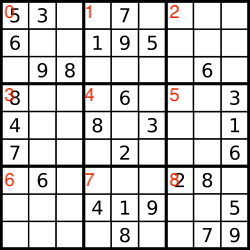

# array

[TOC]

## LC36.有效的数独

分析题目可以发现该题需要对每一行，每一列，每一个九宫格出现的数字都需要判断是否有重复。所以我们需要哈希表的这种记录结构来判断新元素是否已经在之前出现过。

其次一个容易搞错的点是，我们需要判断九宫格里的元素是否出现过，那就要求我们能根据当前下标范围，拿到九宫格对应范围的哈希结构。



因为是二维数组，且绝大多的记忆结构都可以用数组来代替，开销比哈希表更少，所以我们用数组充当哈希表记录是否出现过。

```java
boolean[][] rows = new boolean[9][9];
boolean[][] cols = new boolean[9][9];
boolean[][] area = new boolean[9][9];
```

我们用二维数组的从左到右，从上往下的遍历方式遍历每个元素，然后在该过程记录元素是否出现过。

```java
public boolean isValidSudoku(char[][] board) {
    // rows/cols[i][v] 表示第 i 行/列值 v 是否存在
    boolean[][] rows = new boolean[9][9];
    boolean[][] cols = new boolean[9][9];
    // area[i][v] 表示第 i 个区值 v 是否存在
    boolean[][] area = new boolean[9][9];
    for (int i = 0; i < 9; i++) {
        for (int j = 0; j < 9; j++) {
            int c = board[i][j];
            if (c == '.') continue;
            int u = c - '0' - 1;
            int idx = i / 3 * 3 + j / 3;
            if (rows[i][u] || cols[j][u] || area[idx][u]) return false;
            rows[i][u] = col[j][u] = area[idx][u] = true;
        }
    }    
}
```

## 27.移除元素

[27. 移除元素](https://leetcode.cn/problems/remove-element/)

### 题目

```
Given a sorted array, remove the duplicates in place such that each element appear only once
and return the new length.
Do not allocate extra space for another array, you must do this in place with constant memory.
For example, Given input array A = [1,1,2],
Your function should return length = 2, and A is now [1,2].
```

### 分析

数组是连续的一段地址空间，题目要求原地删除原数组中的重复元素，首先需要去理解不开辟新的空间怎么去原地呢？其实就是如果是重复的值，我们需要通过覆盖操作实现。

在遍历的过程中，为了保证记录不重复的数组元素的位置，我们除了遍历指针 i 之外还需要一个变量 idx，要重点去理解 idx 表示什么？idx 表示当前已遍历原数组后的无重复元素的下标位置。即刚开始 idx = 0，在 i 的遍历过程中，如果发现 nums[i] 的值是和 idx 不一样的，我们更新 idx + 1 的值。

之后还有一道类似题目，要求移除元素，但是要保留原数组中重复的元素次数不能超过 x 次，那怎么做呢？举例    x 的值为 2，即在数组 [1, 1, 1, 1, 2, 2, 2, 3, 3] 移除后返回 [1, 1, 2, 2, 3, 3]。

我们可以总结一般性，我们永远去维护 idx 的定义为当前已遍历数组满足移除条件后的正确位置。在处理保留多个元素的逻辑中，我们保证 [idx - 2, idx) 区间的元素一定是满足移除条件的，那么 idx 从 2 开始，当 i 和 idx-2 的结果不一致时，我们更新 nums[idx++] = nums[i]。否则，让 i 继续往后遍历即可。

总结可以发现，我们要处理的是什么情况下需要更新 idx，idx 之前的一定是已经处理完的成功的，然后在 i 的遍历过程中同时更新 idx 和 i。

### 代码

