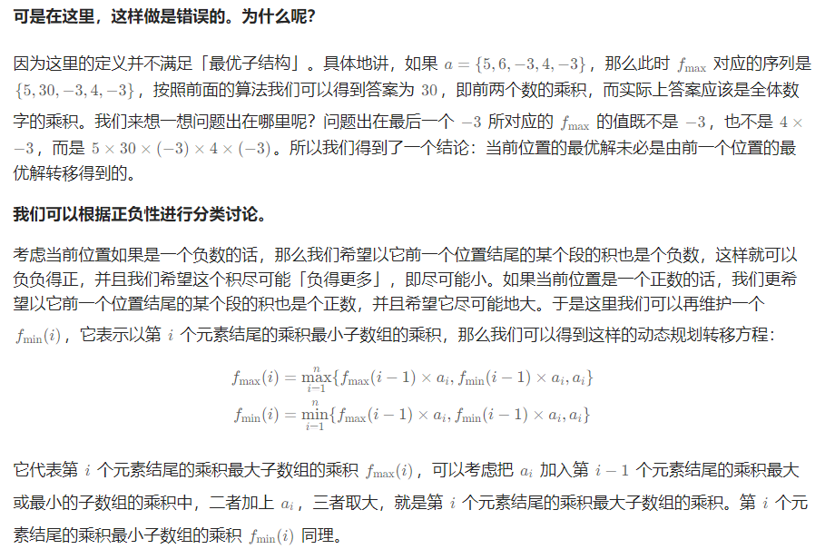

# dp

[TOC]

reference link:

MIT：[MIT课程](https://youtu.be/OQ5jsbhAv_M?si=JiwQsNpbsaIkuhIm)

动态规划 = 递归 + 记录状态

解决问题结果由很多重叠子问题的结果推导而来的问题。所以一般应用于**最优子问题**结构，递推出最优结果。与搜索算法不同的地方在于记录子问题的结果避免重复搜索。

该系列题目最重要的是对于 dp 数组的定义，以及 dp 数组的推导过程。因为有些题目是直接定义题目结果为 dp 数组，而有些题目需要先定义并计算 dp 数组，并从 dp 数组计算推导出最终结果。

一般题目输入为一维数组和二维数组，我们需要推导  dp 数组，联系数组，其实大多情况下，我们的定义针对 dp[i] 来思考，一般定义为以 dp[i] 结尾的...巨多，因为这样遍历完数组，就能推导出答案。

针对 dp 数组的长度为原输入数组的 n 还是 n + 1，其实主要看你定义的时候如何定义，如果长度为 n，则 dp 的定义很多时候并不是符合我们思考的规律，因为我们的思维是有一个元素算是第一个，所以一般是 **"第一个~第 n 个"**，但是对于数组来说通过下标访问的时候却是 nums[0]-nums[n - 1] 所以，不同的定义在每一个元素的处理上要保证数组下标不越界，保证逻辑定义和数组中处理的元素一致即可。**所以定义为 n + 1 长度是为了更加符合我们的直觉和思考方式。**

## 经典入门

### 70.爬楼梯

[70. 爬楼梯](https://leetcode.cn/problems/climbing-stairs/)

可以把输入建模为 1...n 的一维数组，结果要求到达 n 的所有不同方式。

**dp[i] 表示爬上第 i 层台阶有多少不同方式**

所以 dp[i] = dp[i - 1] + dp[i - 2]

记录状态的递归：

```java
class Solution {
    public int climbStairs(int n) {
        Map<Integer, Integer> memo = new HashMap<>();
        return dfs(n, memo);
    }

    public int dfs(int n, Map<Integer, Integer> memo) {
        if (n == 1) return 1;
        if (n == 2) return 2;
        
        if (memo.containsKey(n)) return memo.get(n);
        else memo.put(n, dfs(n-1, memo) + dfs(n-2, memo));
   
        return memo.get(n);
    }
}
```

转化为 dp：

```java
class Solution {
    public int climbStairs(int n) {
        if (n <= 1) return n;
        int[] dp = new int[n + 1];
        dp[1] = 1;
        dp[2] = 2;
        for (int i = 3; i <= n; i++) {
            dp[i] = dp[i - 1] + dp[i - 2];
        }
        return dp[n];
    }
}
```

### 509.斐波那契数

[509. 斐波那契数](https://leetcode.cn/problems/fibonacci-number/)

题目直接告诉你递推关系：`F(n) = F(n - 1) + F(n - 2)，其中 n > 1`

这道题目引出了空间压缩的概念，即当你发现 dp[i] 只与 dp[i - 1] 有关，且之后不会再用到，就可以用常量代替。

```java
class Solution {
    public int fib(int n) {
        int ans = -1;
        if (n == 1 || n == 0) return n;
        int pre = 0, cur = 1;
        for (int i = 2; i <= n; i++) {
            ans = pre + cur;
            pre = cur;
            cur = ans;
        }
        return ans;
    }
}
```

### 413.等差数列划分

[413. 等差数列划分](https://leetcode.cn/problems/arithmetic-slices/)

本题目 dp[i] 的定义为 "**以 nums[i] 结尾的连续子数组的最大个数**"

所以要求最总结果，就需要将以每个元素结尾的 dp[0->n-1] 累加从而得到能划分的所有等差数列。

```java
class Solution {
    public int numberOfArithmeticSlices(int[] nums) {
        int n = nums.length;
        int ans = 0;
        if (n < 3) return ans;
        int[] dp = new int[nums.length];
        for (int i = 2; i < n; i++) {
            if (nums[i] - nums[i - 1] == nums[i - 1] - nums[i - 2]) {
                dp[i] = dp[i - 1] + 1;
                ans += dp[i];
            }
        }
        return ans;
    }
}
```

## 股票

## 背包

## 子数组和

### 53.最大子数组和

[53. 最大子数组和](https://leetcode.cn/problems/maximum-subarray/)

找出一个具有最大和的连续子数组（子数组最少包含一个元素），返回其最大和。子数组我们首先确认一点就是连续性，要找出有最大和的连续子数组，根据子数组里的元素有正有负，所以不能单纯定义 dp[i] 为前 i 个元素的最大子数组和。因为这样的话，定义失去了数组连续性的条件。对于数组遍历到的每一个值，我们需要知道该值的正负都会影响包含该值的子数组的最大和，我们的遍历又都是顺序进行的，从数组头到尾或者尾到头。

当前元素的正负性对原子数组和的影响很大，如果是正数，永远是增加了子数组和，但是如果是负数，我们就得判断当前值以及前面的子数组是否有必要影响到后续的子数组和。

其次最容易与其他类型的题目混为一谈的一点是：最大子数组和求解过程是需要计算所有的 dp[0...i] 但是最终结果却未必是 dp[i]，必须遍历一遍找出最大值，因为当前为负值的时候，我们既不能抛弃前面的子数组和，又不能肯定包含了该负值之后的子数组会不会比之前的大。

还有一点，看到子数组，我们常规思维就是直接从连续正的子数组序列往两边扩展，但是 dp[i] 定义为以 nums[i] 结尾的最大子数组，不是包含的多了吗？我可能需要包含 nums[i]、nums[i-1] 但不需要 nums[i-2]、nums[i-3]...那这么定义 dp[i] 怎么能覆盖全所有可能呢？其实这就是个思维问题了，我们是从一个元素到两个元素到三个元素一直扩展上去的，每一个 dp[i] 都已经是之前所有子数组可能性的最优解了，我们在之后的遍历，又去维护这个可能的最优解，所以最后一定是考虑到了所有情况，然后得到的正确答案。

```java
public int maxSubArray(int[] nums) {
    int n = nums.length;
    // dp[i] 表示以 nums[i] 结尾的最大子数组和
    int[] dp = new int[n];
    dp[0] = (nums[0] > 0 ? nums[0] : 0);
    for (int i = 1; i < n; i++) {
        if (nums[i] > 0) dp[i] = dp[i - 1] + nums[i];
        else dp[i] = (dp[i - 1] + nums[i] > 0 ? dp[i - 1] + nums[i] : 0);
    }
    int ans = 0;
    for (int v : dp) ans = Math.max(v, ans);
    return ans;
}
```

不对，思路反了，思路错了，我们不用考虑当前值的正负，我们应该考虑当前处理元素之前的最大子数组和的正负从而决定包含当前元素的子数组的最大子数组和。

```java
public int maxSubArray(int[] nums) {
    int n = nums.length;
    int[] dp = new int[n];
    dp[0] = nums[0]; // 子数组必须包含一个元素
    int ans = dp[0];
    for (int i = 1; i < n; i++) {
        if (dp[i - 1] > 0) dp[i] = dp[i - 1] + nums[i]; // 其实也可以空间优化
        else dp[i] = nums[i];
        ans = Math.max(dp[i], ans);
    }
    return ans;
}
```

## 子数组乘积

子数组乘积是，针对子数组里的元素，有正有负，所以你选择一个正数或负数造成的影响是不一样的。我们一般题目要求求最值，最值一般都可以用到 DP 的思维，从数组开始遍历到结束，在这个过程中维护想要的结果进行更新，针对某个元素进行选取与不选取的不同处理。

### LC152.乘积最大的子数组

[152. 乘积最大子数组](https://leetcode.cn/problems/maximum-product-subarray/)

子数组的乘积是不是按照子数组的和来处理就可以了呢？不行！因为负负得正，你不能只记录当前的最大乘积，因为如果当前处理元素之前有一个特别小的负数，在当前元素为负值的时候，就会得到最大值。

有时候我们会定义 dp[i] 表示前 i 个元素得到的最值，有时候我们定义以 nums[i] 结尾的子数组的最值，那么这个定义有什么区别呢？怎么理解并正确选择呢？其实核心在于前 i 个元素的最值在经过中间阶段后，对后续的元素的 dp 结果有没有意义，如果是子数组类型的问题，0 元素之前的无论多少元素在包含 0 元素之后，其余最值都无意义，对后续没有参考价值，因为如果包含了 0 元素，那么结果已经被 0 主导了，所以**子数组类的问题，应该都定义为以元素 i 结尾的子数组的最值，判断自己单独成一段还是加入前一个元素对应的一段**。



关键点就是这句话：==“由于存在负数，那么会导致最大的变最小的，最小的变最大的。因此还需要维护当前最小值imin。”==

```java
public int maxProduct(int[] nums) {
    int n = nums.length;
    // dp[i][0] 以 i 结尾子数组最小值 dp[i][1] 以 i 结尾子数组最大值
    int[][] dp = new int[n][2];
    dp[0][0] = nums[0];
    dp[0][1] = nums[0];
    
    int ans = dp[0][1];
    
    for (int i = 1; i < n; i++) {
        dp[i][0] = Math.min(dp[i - 1][1] * nums[i], Math.min(dp[i - 1][0] * nums[i], nums[i]));
        dp[i][1] = Math.max(dp[i - 1][0] * nums[i], Math.max(dp[i - 1][1] * nums[i], nums[i]));
        ans = Math.max(ans, dp[i][1]);
    }
    return ans;
}
```

### LC2708.一个小组最大的实力值

[2708. 一个小组的最大实力值](https://leetcode.cn/problems/maximum-strength-of-a-group/)

本道题目不是子数组了，是可以选部分元素，然后得到所选小组的最大实力值。但是因为要得到的是乘积，所以存在负数的话会导致最大的变最小的，最小的变最大的，因此还需要维护最小最大两个最值。

```java
public long maxStrength(int[] nums) {
    int n = nums.length;
    // dp[i][0] 前 i 个元素能选到的最小值，dp[i][1] 前 i 个元素能选到的最大值
    long[][] dp = new long[n][2];
    dp[0][0] = nums[0];
    dp[0][1] = nums[0];
    for (int i = 1; i < n; i++) {
        long mx1 = dp[i - 1][0] * nums[i], mx2 = dp[i - 1][1] * nums[i];
        dp[i][0] = min(mx1, mx2, dp[i - 1][0], nums[i]);
        dp[i][1] = max(mx1, mx2, dp[i - 1][1], nums[i]);
    }
    return dp[n - 1][1];
}
private long max(long...args) {
    long ans = args[0];
    for (long num : args) {
        if (num > ans) ans = num;
    }
    return ans;
}
private long min(long...args) {
    long ans = args[0];
    for (long num : args) {
        if (num < ans) ans = num;
    }
    return ans;
}
```

当然可以空间压缩，因为 dp[i] 只与 dp[i - 1] 旧值有关系，完全可以压缩到 O(1) 空间复杂度。

```java
public long maxStrength(int[] nums) {
    int n = nums.length;
    long min = nums[0], max = nums[0];
    for (int i = 1; i < n; i++) {
        long mx1 = min * nums[i], mx2 = max * nums[i];
        min = Math.min(Math.min(mx1, mx2), Math.min(min, nums[i]));
        max = Math.max(Math.max(mx1, mx2), Math.max(max, nums[i]));
    }
    return max;
}
```

## 维护前缀最大值

### LC1014.最佳观光组合

[1014. 最佳观光组合](https://leetcode.cn/problems/best-sightseeing-pair/)

通过对一对观光景点的最高分公式：`v[i] + v[j] + i - j` 进行移项 `(v[j] - j)+(v[i] + i)`，这时候就发现可以遍历 *j*同时维护 *i*< *j*时 **values[i]+i** 的最大值，这样就能得到固定*j*时的最优解，维护所有*j*的最大值就能得到答案。

```java
private int maxScoreSightseeingPair(int[] values) {
    int n = values.length;
    int ans = 0;
    int mx = values[0]; // values[0] + 0
    for (int i = 1; i < n; i++) {
        ans = Math.max(ans, values[i] - i + mx);
        mx = Math.max(mx, values[i] + i);
    }
    return ans;
}
```

