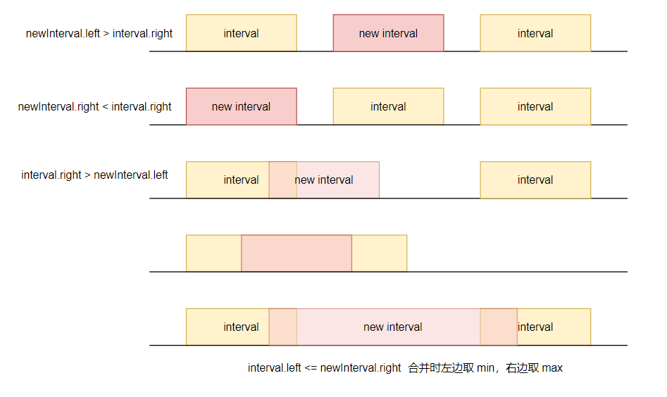

# 区间问题

[参考链接](https://mp.weixin.qq.com/s/ioUlNa4ZToCrun3qb4y4Ow)

区间类问题最容易绕人思路的是针对待处理区间和原区间，如何通过两个不同区间的左右端点关系判断不同情况的逻辑。总体来说有以下几种情况：



## LC56.合并区间

### 题目分析

要合并所有重叠的区间，就需要先去顶所有区间的顺序，以区间左端点排序，然后才能判断区间的重叠关系。

排序后，我们要返回一个合并后的新区间，合并只会缩减原来区间的长度，所以我们定义结果区间数组，长度为原区间数组长度。我们用一个指针 idx 标识结果数组中区间当前已确定的数组下标。在迭代过程中去判断当前遍历的区间是需要新增的，还是需要合并的。如果是合并的，就更新结果区间数组中区间的右端点。

### 题解

```java
class Solution {
    public int[][] merge(int[][] intervals) {
        int m = intervals.length;
        int[][] ans = new int[m][2];
        Arrays.sort(intervals, (pre, cur) -> pre[0] - cur[0]);
        int idx = -1;
        for (int[] cur : intervals) {
            if (idx == -1) ans[++idx] = cur;
            else if (cur[0] > ans[idx][1]) ans[++idx] = cur;
            else ans[idx][1] = Math.max(ans[idx][1], cur[1]);
        }
        return Arrays.copyOf(ans, idx + 1);
    }
}
```

## LC57.插入区间

### 题目分析

要合并所有的重复区间，我们分为三步，第一步先找出在合并区间左边不受影响的一部分区间。即：

`intervals[i][1] < newInterval[0]`；其次我们得合并遇到的所有区间，合并即左端点取较小值，右端点取较大值，那如何判断是重叠的呢？`intervals[i][0] <= newInterval[1]`，将合并完的区间添加到结果后，最后将后续不重复的区间放入原来区间。

### 题解

```java
public int[][] insert(int[][] intervals, int[] newInterval) {
    int m = intervals.length;
    int[][] ans = new int[m + 1][2];
    int i = 0, idx = 0;
    // 待插入区间左侧相离的区间不处理
    while (i < m && intervals[i][1] < newInterval[0]) {
        ans[idx++] = intervals[i++];
    }
    // 有重叠的区间需要合并，合并取并集
    while (i < m && intervals[i][0] <= newInterval[1]) {
        newInterval[0] = Math.min(newInterval[0], intervals[i][0]);
        newInterval[1] = Math.max(newInterval[1], intervals[i][1]);
        i++;
    }
    ans[idx++] = newInterval;
    // 剩余区间不处理，当待插入区间在最左边且相离直接会走此处
    while (i < m) ans[idx++] = intervals[i++];
    return Arrays.copyOf(ans, idx);
}
```

## LC252.会议室$

https://doocs.github.io/leetcode/lc/252/

### 题目描述

给定一个会议时间安排的数组 `intervals` ，每个会议时间都会包括开始和结束的时间 `intervals[i] = [starti, endi]` ，请你判断一个人是否能够参加这里面的全部会议。

**示例 1：**

```
输入：intervals = [[0,30],[5,10],[15,20]]
输出：false
```

**示例 2：**

```
输入：intervals = [[7,10],[2,4]]
输出：true
```

### 题目分析

判断一个人能否参加全部的会议，说明给出的会议时间，没有任何重复。如何判断所有区间没有任何重复？

首先根据区间的左端点顺序排序，然后依次比较，如果发现当前的区间左端点在上一个区间右端点的左边，则有重复。

```java
Arrays.sort(intervals, (pre, cur) -> pre[0] - cur[0]);
if (cur[0] < pre[1]) return false;
```

### 题解

```java
class Solution {
    public boolean canAttendMeetings(int[][] intervals) {
        Arrays.sort(intervals, (a, b) -> a[0] - b[0]);
        for (int i = 1; i < intervals.length; ++i) {
            var a = intervals[i - 1];
            var b = intervals[i];
            if (a[1] > b[0]) {
                return false;
            }
        }
        return true;
    }
}
```

## LC1288.删除被覆盖区间

[1288. 删除被覆盖区间](https://leetcode.cn/problems/remove-covered-intervals/)

### 题目描述

给你一个区间列表，请你删除列表中被其他区间所覆盖的区间。

只有当 `c <= a` 且 `b <= d` 时，我们才认为区间 `[a,b)` 被区间 `[c,d)` 覆盖。

在完成所有删除操作后，请你返回列表中剩余区间的数目。

**示例：**

```
输入：intervals = [[1,4],[3,6],[2,8]]
输出：2
解释：区间 [3,6] 被区间 [2,8] 覆盖，所以它被删除了。
```

### 题目分析

还是需要判断覆盖问题，判断覆盖的时候我们先按照左端点排序，然后左端点相同时按照右端点逆序排，这样的目的是为了让后出现的区间的右端点一定在被覆盖范围内。这样就可以按照上面的思路：

```java
class Solution {
    public int removeCoveredIntervals(int[][] intervals) {
        Arrays.sort(intervals, (pre, cur) -> {
            if (cur[0] == pre[0]) return cur[1] - pre[1];
            else return pre[0] - cur[0];
        });
        int m = intervals.length;
        int[][] ans = new int[m][2];
        int idx = -1;
        for (int[] cur : intervals) {
            if (idx == -1) ans[++idx] = cur;
            else if (cur[1] <= ans[idx][1]) continue;
            else {
                ans[++idx] = cur;
            }
        }
        return idx + 1;
    }
}
```

官解是为了得到答案，并不需要维护二维数组，而是直接维护一个右端点最大值 rmax

```java
int ans = m, rmax = intervals[0][1];
for (int i = 1; i < m; i++) {
    if (intervals[i][1] <= rmax) --ans;
    else rmax = interval[i][1];
}
```

```java
class Solution {
    public int removeCoveredIntervals(int[][] intervals) {
        Arrays.sort(intervals, (pre, cur) -> {
            return (cur[0] == pre[0]) 
                    ? cur[1] - pre[1]
                    : pre[0] - cur[0];
        });
        int m = intervals.length;
        int ans = m, rmax = intervals[0][1];
        for (int i = 1; i < m; i++) {
            if (intervals[i][1] <= rmax) --ans;
            else rmax = intervals[i][1];
        }
        return ans;
    }
}
```

## LC228. 汇总区间

### 题意分析

看到题目其实很懵，不懂题目的描述什么意思，但是看题目示例其实大体就有思路了，其实就是希望你把所有的连续的数字放置在一个区间，区间的表示通过首位两数字中间加 "->" 来表示，然后返回这么个列表。

那么有什么思路呢，肯定是外层循环去遍历每一个元素，在一层循环里做一件事，找到一个连续的序列，然后将这个序列转换为 "lo->hi" 的字符添加到结果列表，直至整个数组处理完。

### 题解

```java
class Solution {
    public List<String> summaryRanges(int[] nums) {
        List<String> ans = new ArrayList<>();
        int n = nums.length;
        int i = 0;
        while (i < n) {
            int lo = i;
            i++;
            while (i < n && nums[i] == nums[i - 1] + 1) i++;
            int hi = i - 1;
            String tmp = Integer.toString(nums[lo]);
            if (lo < hi) tmp = tmp + "->" + nums[hi];
            ans.add(tmp);
        }
        return ans;
    }
}
```

字符串拼接的逻辑可以用 StringBuilder 代替

```java
StringBuilder tmp = new StringBuilder(Integer.toString(nums[lo]));
if (lo < hi) tmp.append("->").append(nums[hi]);
ans.add(tmp.toString());
```

### 扩展

官解的代码是我之前讲周赛时提到的「分组循环」。这个写法的好处是，无需特判 *nums* 是否为空，也无需在循环结束后，再补上处理最后一段区间的逻辑。以我的经验，这种写法是所有写法中最不容易出 bug 的，推荐大家记住。

适用场景：按照题目要求，数组会被分割成若干段，且每一段的判断/处理逻辑是一样的。

注：虽然代码写的是一个二重循环，但 `i += 1` 这句话至多执行 *n* 次，所以总的时间复杂度仍然是 O(*n*) 的。

一般来说，分组循环的模板如下（根据题目调整）：

```
i, n = 0, len(nums)
while i < n:
    start = i
    while i < n and ...:
        i += 1
    # 从 start 到 i-1 是一段
    # 下一段从 i 开始，无需 i+=1
```

学会一个模板是远远不够的，需要大量练习才能灵活运用。

https://leetcode.cn/problems/summary-ranges/solutions/553645/hui-zong-qu-jian-by-leetcode-solution-6zrs/comments/2106748

有更多类似题目可以联系。