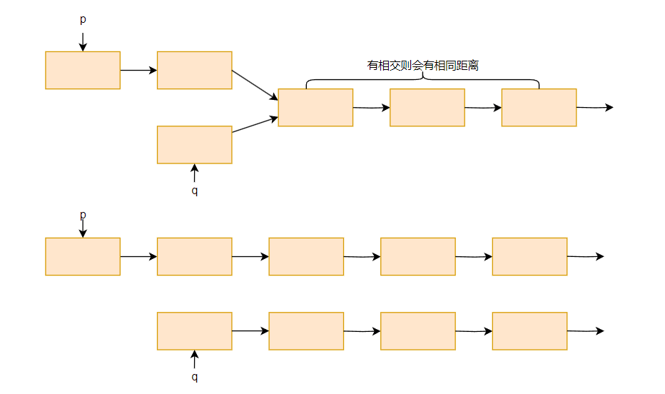

# linked list

链表是一种非常基础的数据结构，一般分为单链表和双链表，双链表可以从每个节点前后找，**单链表只能从前往后**，所以如果针对单链表要进行一些处理，**反转单链表**是一种常见的思维和处理方式，通过两个指针在遍历的过程中改变链表的指向。

链表的处理中，链表的判断条件如何确定也是一个容易出错的点，有时候你只需要判断 ==cur != null==，快慢指针的场景你需要判断 ==fast != null && fast.next != null==，不同的题目所面临的场景是不一样的，请务必在编码前想清楚，想明白，如果突然脑子里卡壳了，怎么都想不到怎么办？读题，一步一步来，搞清楚自己每一步需要做什么，例如链表相交这道题目，让你找到交点，你突然不知道判断两个指针是否为空，或者是否为 null 了，停下来，再模拟一遍你的思路，你的问题只是在于如何将思路转化为代码，先不用考虑代码的最优化，先把思路实现。

单链表的数据结构定义：

```java
public class ListNode {
    int val;
    ListNode next;
    ListNode(int x) {
        this.val = x;
        this.next = null;
    }
}
```

双链表的定义：

```java
public class DLinkedNode {
    int val;
    ListNode pre;
    ListNode next;
    List(int x) {
        this.val = x;
        this.pre = null;
        this.next = null;
    }
}
```

## LC160.相交链表

[160. 相交链表](https://leetcode.cn/problems/intersection-of-two-linked-lists/)

### 分析

传统思路：我们让其中一个链表全部进 set，然后遍历第二个链表每一个节点，看是否在这个 set 里出现过。

链表思路：相交链表的解法有一个核心的思维：就是指向两个链表 A 和 B 的指针 p 和 q，如果以相同的速度遍历两遍列表，它们走的距离是一样的，而且，如果有相交的部分，相交节点后面的距离是一样的。



有一种情况是如果 B 链表是 A 链表的子链表呢？其实结论是一样的，除去子链表后的距离，两个指针分别走的距离是一样的，假设 A 链表长度 m，B 链表长度为 n，走相同长度 m+n 一定都会到达 null，那么如果相交，它们在中间一定会相同。由此确定了循环退出条件。

仔细看链表的箭头，如图所示，我们要让它们走相同的距离，则需要让 p 指针走到末尾 null，然后转为另一个链表头继续走，才能保证走的距离相同。分析第一步，其实需要循环 7 次，具体可以按照图数一数。

```java
p = headA, q = headB;
while (p != q) {
    p = (p == null ? headB : p = p.next);
    q = (q == null ? headA : q = q.next);
}
return p/q;
```

### 实现

```java
public ListNode getIntersectionNode(ListNode headA, ListNode headB) {
    ListNode pA = headA, pB = headB;
    while (pA != pB) {
        pA = pA == null ? headB : pA.next;
        pB = pB == null ? headA : pB.next;
    }
    return pA;
}
```

## LC148.排序链表

[148. 排序链表](https://leetcode.cn/problems/sort-list/)

### 分析

要求将一个无序的链表按照升序重新排列。该题要求排序链表，那么我们可以思考排序数组应该怎么实现，对链表有什么可取之处？

常规的数组排序时间复杂度 O(n2)，而且都是通过循环遍历交换去实现的，链表可以吗？链表的问题在于，你不能根据下表立马得到具体的某个元素节点，所以对列表的排序本质在于对有序子节点的合并，因此链表的排序是符合归并排序的思想的。

所以我们定义一个 sort(ListNode head) 函数，首先我们得将原链表分为两半，因此需要查找中点，查找可以使用快慢指针，用 slow 和 fast 快慢指针快速查找链表的中间节点。记住找中点的写法！！！ 

初始化`slow = head, fast = head.next` 
判断条件 `while(fast != null && fast.next != null)`

```java
private ListNode findM(ListNode head) {
    ListNode slow = head, fast = head.next;
    while (fast != null && fast.next != null) {
        slow = slow.next;
        fast = fast.next.next;
    }
    return slow;
}
// 2->1->3->4->5 return 3
// 2->1 return 2
// 2 return 2
// 2->1->3->4 return 1
```

因为链表的合并都会产生新的节点，所以必须返回排序后子链表的头结点，之后进行合并，因为头结点可能会变，所以会常用到虚拟节点，用来记录排序后子链表的头结点。整体逻辑如下：

```java
private ListNode sortL(ListNode head) {
    if (head == null || head.next == null) return head;
    ListNode mid = findM(head);
    ListNode tmp = mid.next;
    mid.next = null;
    ListNode left = sortL(head);
    ListNode right = sortL(tmp);
    return mergeL(left, right);
}
```

合并过程

```java
private ListNode mergeL(ListNode left, ListNode right) {
    ListNode dummy = new ListNode(-1);
    ListNode p = left, q = right, cur = dummy;
    while (p != null || q != null) {
        if (p == null) {
            cur.next = q;
            break;
        }
        if (q == null) {
            cur.next = p;
            break;
        } 
        if (p.val <=  q.val) {
            cur.next = p;
            p = p.next;
        } else {
            cur.next = q;
            q = q.next;
        }
        cur = cur.next;
    }
    return dummy.next;
}
```

