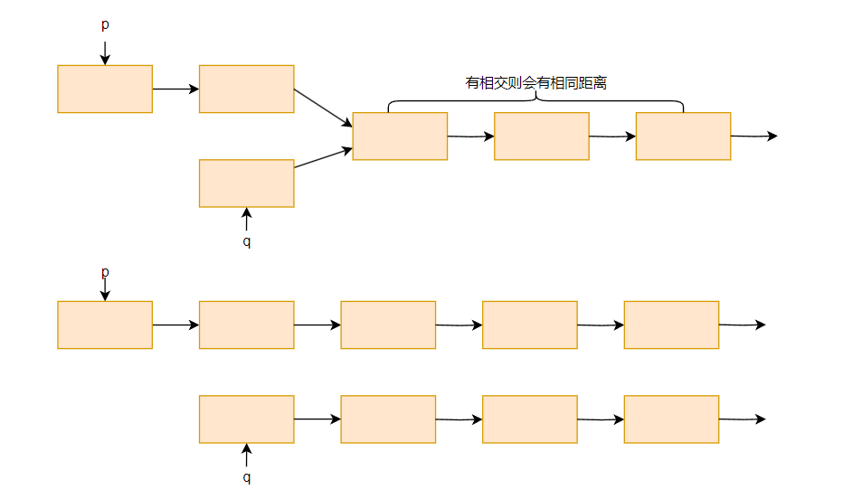
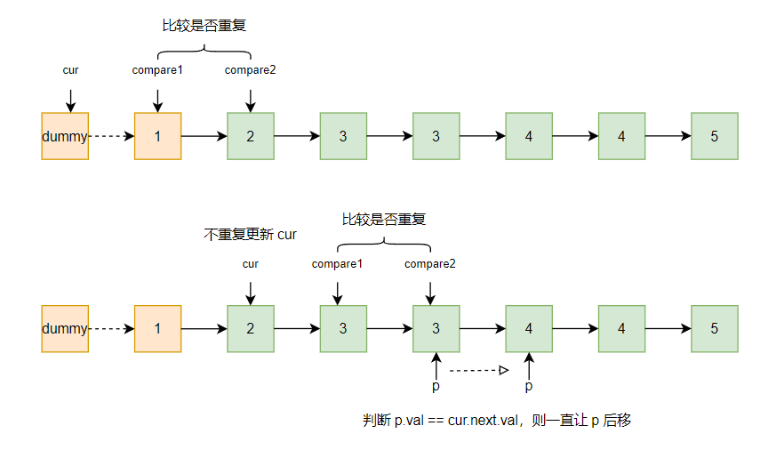
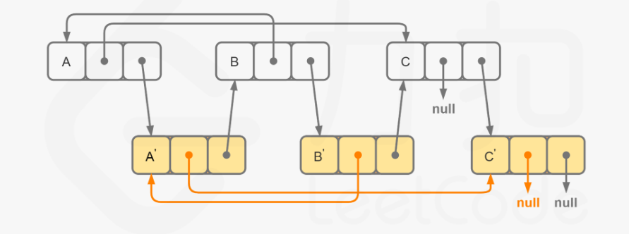

# linkedlist

[TOC]

链表是一种非常基础的数据结构，一般分为单链表和双链表，双链表可以从每个节点前后找，**单链表只能从前往后**，所以如果针对单链表要进行一些处理，**反转单链表**是一种常见的思维和处理方式，通过两个指针在遍历的过程中改变链表的指向。

链表的处理中，链表的判断条件如何确定也是一个容易出错的点，有时候你只需要判断 ==cur != null==，快慢指针的场景你需要判断 ==fast != null && fast.next != null==，不同的题目所面临的场景是不一样的，请务必在编码前想清楚，想明白，如果突然脑子里卡壳了，怎么都想不到怎么办？读题，一步一步来，搞清楚自己每一步需要做什么，例如链表相交这道题目，让你找到交点，你突然不知道判断两个指针是否为空，或者是否为 null 了，停下来，再模拟一遍你的思路，你的问题只是在于如何将思路转化为代码，先不用考虑代码的最优化，先把思路实现。

单链表的数据结构定义：

```java
public class ListNode {
    int val;
    ListNode next;
    ListNode(int x) {
        this.val = x;
        this.next = null;
    }
}
```

双链表的定义：

```java
public class DLinkedNode {
    int val;
    ListNode pre;
    ListNode next;
    List(int x) {
        this.val = x;
        this.pre = null;
        this.next = null;
    }
}
```

## LC206.反转链表

[206. 反转链表](https://leetcode.cn/problems/reverse-linked-list/)

链表入门题目，如何用 pre、cur 两个指针去反转链表，感觉没啥说的，记录当前指针的下一个节点，让当前指针指向前一个节点，然后当前指针和前一个之后同时往后移，一直循环即可，循环退出条件肯定是当前指针指向节点为 null 了。

一般该方法作为常见链表算法的基本思想，作为一个子函数来发挥作用。所以就当刻板印象记吧。

```java
private ListNode reverseL(ListNode head) {
    ListNode pre = null, cur = head, aux = null;
    while (cur != null) {
        aux = cur.next;
        cur.next = pre;
        pre = cur;
        cur = aux;
    }
    return pre;
}
```

## LCR136.删除链表的节点

[LCR 136. 删除链表的节点](https://leetcode.cn/problems/shan-chu-lian-biao-de-jie-dian-lcof/)

LCR 为 LeetCode Recruit 缩写，代指为剑指 offer 上的题目。

要删除链表指定的一个节点，其实就是将该链表之前的一个节点的 next 指定到要删除节点的 next，然后释放删除节点的内存，一些语言有 gc，所以内存释放也不用管。

分析要判断当前节点是被删除的节点，则必须有一个遍历指针 cur 指示当前在处理的节点，但是我们要删除，需要知道 cur 的前一个节点，所以我们定义一个辅助指针 pre，在遍历过程记录 cur 的前一个节点。

这么考虑是很简单，但我们忽略了一点，就是如果**删除的是头节点怎么办**？如果删除的是 head，那么导致 pre 并为更新，所以会导致代码需要特判，增加处理逻辑。因此虚拟头结点 dummy node，是我们很常见的一个做法。

```java
ListNode dummy = new ListNode(-1);
dummy.next = head;
```

在判断的时候是判断 `while (cur != null)` 还是判断 `while(cur.next != null)`，其实这主要是根据我们循环退出后要进行的操作来看，放到本题，如果我们循环退出后要执行 `pre.next = cur.next` 那么 cur 为 null 后发生空指针，所以我们的判断条件肯定是后者。

```java
while (cur.next != null && cur.val != val) {}
```

所以针对链表中无重复值节点的情况，我们的整体代码是这样的：

```java
public ListNode deleteNode(ListNode head, int val) {
    ListNode dummy = new ListNode(-1);
    dummy.next = head;
    ListNode pre = dummy, cur = head;
    while (cur.next != null && cur.val != val) {
        pre = cur;
        cur = cur.next;
    }
    pre.next = cur.next;
    return dummy.next;
}
```

还有一种场景，如果要删除的节点有多个怎么处理？那么我们在判断找到等于给定值的节点后，还得继续往后遍历。那么我们的判断条件就是如果 cur.val 与 val 不相同后，我们才更新两个指针，仍然需要虚拟头来避免头结点的特判问题。

```java
public ListNode deleteNode(ListNode head, int val) {
    ListNode dummy = new ListNode(-1);
    dummy.next = head;
    ListNode pre = dummy, cur = head;
    while (cur.next != null) { // 这么判断就需要处理最后一个节点，改为 cur != null 就不需要
        if (cur.val == val) {
            cur = cur.next;
        } else {
            pre = cur;
            cur = cur.next;
        }
    }
    pre.next = (cur.val == val ? null : cur); // 特判最后一个节点
    return dummy.next;
}
// 这种写法可以满足上面的非重复节点的删除指定节点的需求，但是循环会多走一遍，不会提前停止。
public ListNode deleteNode(ListNode head, int val) {
    ListNode dummy = new ListNode(-1);
    dummy.next = head;
    ListNode pre = dummy, cur = head;
    while (cur != null) {
        if (cur.val == val) {
            cur = cur.next;
        } else {
            pre = cur;
            cur = cur.next;
        }
    }
    return dummy.next;
}
```

感觉很乱，其实这是自己的抓马过程，思维不清晰，最后几种写法都写了后发现其实 while 判断只判断 `(cur != null)` 即可。原写法可以优化为：

```java
public ListNode deleteNode(ListNode head, int val) {
    ListNode dummy = new ListNode(-1);
    dummy.next = head;
    ListNode pre = dummy, cur = head;
    while (cur!= null && cur.val != val) { // 针对删除多个节点的情况，把值的判断提到 if 里去即可
        pre = cur;
        cur = cur.next;
    }
    pre.next = pre.next.next;
    return dummy.next;
}
```

## LC160.相交链表

[160. 相交链表](https://leetcode.cn/problems/intersection-of-two-linked-lists/)

### 分析

传统思路：我们让其中一个链表全部进 set，然后遍历第二个链表每一个节点，看是否在这个 set 里出现过。

链表思路：相交链表的解法有一个核心的思维：就是指向两个链表 A 和 B 的指针 p 和 q，如果以相同的速度遍历两遍列表，它们走的距离是一样的，而且，如果有相交的部分，相交节点后面的距离是一样的。



有一种情况是如果 B 链表是 A 链表的子链表呢？其实结论是一样的，除去子链表后的距离，两个指针分别走的距离是一样的，假设 A 链表长度 m，B 链表长度为 n，走相同长度 m+n 一定都会到达 null，那么如果相交，它们在中间一定会相同。由此确定了循环退出条件。

仔细看链表的箭头，如图所示，我们要让它们走相同的距离，则需要让 p 指针走到末尾 null，然后转为另一个链表头继续走，才能保证走的距离相同。分析第一步，其实需要循环 7 次，具体可以按照图数一数。

```java
p = headA, q = headB;
while (p != q) {
    p = (p == null ? headB : p = p.next);
    q = (q == null ? headA : q = q.next);
}
return p/q;
```

### 实现

```java
public ListNode getIntersectionNode(ListNode headA, ListNode headB) {
    ListNode pA = headA, pB = headB;
    while (pA != pB) {
        pA = pA == null ? headB : pA.next;
        pB = pB == null ? headA : pB.next;
    }
    return pA;
}
```

## LC148.排序链表

[148. 排序链表](https://leetcode.cn/problems/sort-list/)

要求将一个无序的链表按照升序重新排列。该题要求排序链表，那么我们可以思考排序数组应该怎么实现，对链表有什么可取之处？

常规的数组排序时间复杂度 O(n2)，而且都是通过循环遍历交换去实现的，链表可以吗？链表的问题在于，你不能根据下表立马得到具体的某个元素节点，所以对列表的排序本质在于对有序子节点的合并，因此链表的排序是符合归并排序的思想的。那可以使用插入排序的思想吗？请看 147 题。服了！

所以我们定义一个 sort(ListNode head) 函数，首先我们得将原链表分为两半，因此需要查找中点，查找可以使用快慢指针，用 slow 和 fast 快慢指针快速查找链表的中间节点。记住找中点的写法！！

初始化`slow = head, fast = head.next`
判断条件 `while(fast != null && fast.next != null)`

```java
private ListNode findM(ListNode head) {
    ListNode slow = head, fast = head.next;
    while (fast != null && fast.next != null) {
        slow = slow.next;
        fast = fast.next.next;
    }
    return slow;
}
// 2->1->3->4->5 return 3
// 2->1 return 2
// 2 return 2
// 2->1->3->4 return 1
```

因为链表的合并都会产生新的节点，所以必须返回排序后子链表的头结点，之后进行合并，因为头结点可能会变，所以会常用到虚拟节点，用来记录排序后子链表的头结点。整体逻辑如下：

```java
private ListNode sortL(ListNode head) {
    if (head == null || head.next == null) return head;
    ListNode mid = findM(head);
    ListNode tmp = mid.next;
    mid.next = null;
    ListNode left = sortL(head);
    ListNode right = sortL(tmp);
    return mergeL(left, right);
}
```

合并过程

```java
private ListNode mergeL(ListNode left, ListNode right) {
    ListNode dummy = new ListNode(-1);
    ListNode p = left, q = right, cur = dummy;
    while (p != null || q != null) {
        if (p == null) {
            cur.next = q;
            break;
        }
        if (q == null) {
            cur.next = p;
            break;
        } 
        if (p.val <=  q.val) {
            cur.next = p;
            p = p.next;
        } else {
            cur.next = q;
            q = q.next;
        }
        cur = cur.next;
    }
    return dummy.next;
}
```

## LC143.重排链表

[143. 重排链表](https://leetcode.cn/problems/reorder-list/)

在社招面试中遇到了这道题，题目本身的目的是让你将 `1->2->3->4->5` 这样的链表重新排序成 `1->5->2->4->3` 这样的链表，然后要求你的时间复杂度为 O(n)，空间复杂度为 O(1)。其实从题目就可以看出来，我们需要将原链表反转，但是要保证不去创建新的链表，即保证空间复杂度为 O(1)，当时我就卡壳了，其实以前刷过这题目，但是可能每次刷题都少了自我思考，只要对答案的搬运工或者所谓的死记硬背，隔一段时间遇到就又不会了，当然也可能是没有定期复习，大脑的记忆本身就是会很短暂，因为你在生活中不会频繁去遇到这东西。

那么有什么思路呢？要将链表的后半段，插入到前半段中，而且后半段是逆序插入的，其实就很好想啊，需要将链表分为两段，后半段反转，然后需要合并两个链表，但是不根据有序性合并，而是合并一个跳一步。首先，找出链表后半段：

```java
private ListNode findM(ListNode head) {
    if (head == null || head.next == null) return head;
    ListNode slow = head, fast = slow.next;
    while (fast != null && fast.next != null) {
        slow = slow.next;
        fast = fast.next.next;
    }
    return slow;
}
```

针对该函数，我们对链表 `1->2->3->4->5`找到 3，然后得到后半段起始节点 4、如果是链表 `1->2->3->4` 我们找到 2，然后得到后半段起始 3。都满足题目要求，然后需要将后半段反转，记得再反转后半段前断开两段链表连接：`mid.next = null;`

```java
private ListNode reverseL(ListNode head) {
    ListNode pre = null, cur = head, aux = null;
    while (cur != null) {
        aux = cur.next;
        cur.next = pre;
        pre = cur;
        cur = aux;
    }
    return pre;
}
```

当得到链表 `1->2->3` 和 链表 `5->4` 后，我们需要合并两链表，合并不是简单的归并排序的合并，而是需要将第二个链表按序插入到第一个链表里面，具体如何操作呢？我们用 p 和 q 指向两个链表头结点，记录 p 指针的下一个节点，判断 q 指针不为空的时候，记录 q 指针的下一个节点，然后让 q 指针成为 p 指针的下一个节点，之后 p 指针也后移。最终会完成整个过程，代码如下：

```java
private ListNode mergeL(ListNode first, ListNode second) {
    ListNode p = first, q = second;
    ListNode p_aux = p, q_aux = q;
    while (q != null) {
        p_aux = p.next;
        q_aux = q.next;
        q.next = p_aux;
        p.next = q;
        p = p_aux;
        q = q_aux;
    }
    return first;
}
```

所以主逻辑代码：

```java
public void reorderList(ListNode head) {
    ListNode mid = findM(head);
    ListNode tmp = mid.next;
    mid.next = null;
    ListNode first = head, second = reverseL(tmp);
    return mergeL(first, second);
}
```

## LC82.删除排序链表中的重复元素II

[82. 删除排序链表中的重复元素 II](https://leetcode.cn/problems/remove-duplicates-from-sorted-list-ii/)


遇到这种删除节点的算法题，一定要首先考虑头结点的处理，因为 head 如果被删了，会和之后的逻辑处理不一样，所以优先用 dummy 来存取最后的头结点。

回归本题，要删除排序链表中的重复元素，即发现重复元素，就给它全部删除掉，那什么时候发现是重复元素呢？发现重复元素后我们需要做什么？一步一步来分析，发现重复元素，我们要记录这段重复元素的前一个节点和后一个节点因为这样才能把这一段删除，那如何发现是重复的呢，即 `cur.next.val == cur.val`，我们用 pre 记录删除重复元素后的链表处理到的每一个节点，当发现重复后，一直让 cur 走到重复元素的末尾，然后记录下一个链表节点。

```java
public ListNode deleteDuplicates(ListNode head) {
    ListNode dummy = new ListNode(-1);
    dummy.next = head;
    ListNode pre = dummy, cur = head, aux = null;
    while (cur != null && cur.next != null) { // 一片混乱
        int val = cur.val;
        while (cur.next.val == val) { // 开始乱写
            cur = cur.next;
        }
        pre = cur; // 胡作非为
        cur = cur.next; // 开心就好
        // 最后 大错特错 大错特错 大错特错
    }
}
```
想法是这样，但是真的去定义循环条件和处理的时候真的难到我了，如果只是判断 cur  和  cur.next 的话，很不好处理，碰到 ...3-3-4-4-5... 这样的链表，得从上一个节点连接到 5，就算是拿一个值去比较，子循环去找 5，其实也很难，那么应该怎么处理呢？

思路其实没区别，我们让 cur 指针一直指向删除后不重复链表的最后一个节点，永远都是拿它的下两个节点进行比较，如果发现相同，我们再循环一次找到找到这个重复子链表的最后节点的下一个节点，先连接到 cur，然后继续重复去处理 cur 之后的节点，只有发现下两个节点的值不重复的，我们让 cur 往后移动。



 ```java
ppublic ListNode deleteDuplicates(ListNode head) {
    ListNode dummy = new ListNode(-1);
    dummy.next = head;
    ListNode cur = dummy, p = null;
    while (cur.next != null) {
        if ((p = cur.next.next) != null && cur.next.val == p.val) {
            while (p != null && p.val == cur.next.val) p = p.next;
            cur.next = p; // 短暂的连接罢了，一轮循环处理一批重复的连续子链表
        } else {
            cur = cur.next;
        }
    }
    return dummy.next;
}
 ```

## LC237.删除链表中的节点

[237. 删除链表中的节点](https://leetcode.cn/problems/delete-node-in-a-linked-list/)

只给你一个节点，就让你删除你怎么办？没有头结点，你没法通过遍历去找到当前待删除节点的前一个节点，那还能怎么办？做过一两次这道题，然后慢慢又都忘了处理方式了。

其实思想就是移花接木，你不要以为必须是那个内存地址，对应的那个节点对象的删除，只是节点对应值的删除罢了，那么如果你这么想，你只需要知道如果删除了这个值，链表会发生什么变化？就像数组一样呗，当前节点删了，后面的节点全部往前唯一一个距离，但是链表又不是连续的，也不需要全部的节点都移动，只需要将后序节点的值赋值到本节点，然后删除后续节点，并连接后续节点后的下一个节点。如果要删除的必须是那个节点呢？也好处理，我们只需要将 node 和 node.next 交换，然后删除 node.next 不就得了嘛，至此，全篇结束。

当然这里题目要求说了，不是 tail 节点，所以不用考虑。

```java
public void deleteNode(ListNode node) {
    node.val = node.next.val;
    node.next = node.next.next;
}
```

## LC876.链表的中间节点

[876. 链表的中间结点](https://leetcode.cn/problems/middle-of-the-linked-list/)

寻找中间节点 ，如果发现有两个，则取后面那个，这道题就是 2095 题的前奏，这道题让你找，那道题让你删，所以怎么找？快慢指针，怎么写快慢指针？按规范写法走：

```java
public ListNode middleNode(ListNode head) {
    if (head == null || head.next == null) return head;
    ListNode slow = head, fast = head;
    while (fast != null && fast.next != null) {
        slow = slow.next;
        fast = fast.next.next;
    }
    return slow;
}
```

## LC2095.删除链表的中间节点

[2095. 删除链表的中间节点](https://leetcode.cn/problems/delete-the-middle-node-of-a-linked-list/)

中间的节点题目要求是 长度为 `n` 链表的中间节点是从头数起第 `⌊n / 2⌋` 个节点（下标从 **0** 开始）。寻找中间节点和倒数第 k  个节点思路应该是一样的，快慢指针，快指针先走问题。我们举例来证明解法有效。

`1->2->3->4->5` 要删除的节点是 5/2 = 2，下标为 2 的为 3 节点。快慢指针最后返回的节点是 3，要删除 3，参考删除链表的某个节点。

``1->2->3->4` 要删除的节点是 4/2 = 2，下标为 2 的为 3 节点。快慢指针最后返回 2。

刚开始我的想法是快慢指针，但是发现，对于奇偶长度的链表，它们的处理方式不一样，因为奇数返回的是中间节点，也是要被删除的，而偶数返回被删除的上一个节点，由此写出了下面的代码：

```java
public ListNode deleteMiddle(ListNode head) {
    if (head.next == null) return null;
    int n = 0;
    ListNode p = head;
    while (p != null) {
        n++;
        p = p.next;
    }
    ListNode mid = findM(head);
    if (n % 2 == 0) {
        mid.next = mid.next.next;
    } else {
        mid.val = mid.next.val;
        mid.next = mid.next.next;
    }
    return head;
}

public ListNode findM(ListNode head) {
    ListNode slow = head, fast = head.next;
    while (fast != null && fast.next != null) {
        slow = slow.next;
        fast = fast.next.next;
    }
    return slow;
}
```

是能通过题解，但总感觉题目的解法不应该让你这么玩，于是乎，看了题解，发现可以用 dummy 头太辅助啊，我们让快慢指针都往前一个指针，那么原来的链表长度不就变了嘛，这次我们刚好可以放回要删除中间节点的上一个节点，举例：

`dummy->1->2->3->4->5` 要删除的节点是 5/2 = 2，下标为 2 的为 3 节点。快慢指针从 dummy 开始，则最后返回 2。

`dummy->1->2->3->4` 要删除的节点是 4/2 = 2，下标为 2 的为 3 节点。快慢指针从 dummy 开始，最后返回 2。

刚好是中间节点的上一个节点，对头结点的空指针特判都不需要了，至此，本题结束。

```java
public ListNode deleteMiddle(ListNode head) {
    ListNode dummy = new ListNode(-1);
    dummy.next = head;
    ListNode slow = dummy, fast = head;
    while (fast != null && fast.next != null) {
        slow = slow.next;
        fast = fast.next.next;
    }
    slow.next = slow.next.next;
    return dummy.next;
}
```

等等，你真以为结束了，其实基于我们记录 slow 的前一个指针的想法，我们甚至不需要 dummy。只不过快慢指针的写法微微改变一下

```java
public ListNode deleteMiddle(ListNode head) {
    if (head.next == null) return null; // 但是又需要特判了
    ListNode slow = head, fast = head, pre = null;
    while (fast != null && fast.next != null) {
        pre = slow;
        slow = slow.next;
        fast = fast.next.next;
    }
    pre.next = pre.next.next;
    return head;
}
```

所以快慢指针怎么写？？？规范一下？都从 head 开始，然后往后移动，快指针移动两步呗，这样还能记录 slow 的上一个节点。

```java
public ListNode findM(ListNode head) {
    ListNode slow = head, fast = head, pre = null;
    while (fast != null && fast.next != null) {
        pre = slow;
        slow = slow.next;
        fast = fast.next.next;
    }
    return head;
}
```

## LC147.对链表进行插入排序

[147. 对链表进行插入排序](https://leetcode.cn/problems/insertion-sort-list/)

数组插入排序的思想是拿当前遍历到的元素，从它之前的元素从后往前比较并交换，但是单链表永远只能从前往后走，但是我们不需要移动其他所有元素，所以我们在寻找插入位置的时候永远从前往后寻找，为了防止待插入的是链表头结点，所以我们仍然引入 dummy 节点来返回最后的单链表头。

```java
public ListNode insertionSortList(ListNode head) {
    if (head == null || head.next == null) return head;
    ListNode dummy = new ListNode(-1);
    dummy.next = head;
    ListNode cur = head;
    while (cur.next != null) {
        if (cur.next.val > cur.val) cur = cur.next;
        else {
            ListNode tmp = cur.next; // 记录需要插入的节点
            cur.next = cur.next.next; // 先从原链表删除
            ListNode p = dummy; // 从头开始找
            while (p != cur && p.next.val < tmp.val) {
                p = p.next;
            }
            tmp.next = p.next;
            p.next = tmp;
        }
    }
    return dummy.next;
}
```

## LC234.回文链表

[234. 回文链表](https://leetcode.cn/problems/palindrome-linked-list/)

回文链表即 `1->2->2->1` 或 `1->2->3->2->1` 这样的俩表，一种简单的做法是，放入列表，然后对比第一个元素和最后一个，第二个和倒数第二个...这样的话空间复杂度为 O(n)，有没有更优的写法呢？

其实和重排链表一样，我们只需要找到链表的中点，然后将后半部分反转，然后两个指针同时遍历第一个和第二个链表的每一个节点，如果发现都一样，则说明是回文的。这样又会引出一个问题，如何找到中点呢，我们需要判断奇偶吗？找重点肯定是快慢指针，但是快慢指针要找到合适的 first 和 second 的链表头其实并不好找，可以拿奇偶数链表节点的链表来举例看看：1-2-3-4-5 快慢指针找到的 slow 为 3，slow 的 pre 为 2；1-2-3-4 找到的 slow 为 3，slow 的 pre 为 2。发现其实并不能通用，那有什么好的办法呢？借助虚拟头在原链表前加一个元素，让 slow.next 最终指向的一定是 second 链表的头，其实还有一种方式，我们不需要快慢指针，但是在快慢指针的判断上下文章

```java
public ListNode findM(ListNode head) {
    if (head == null || head.next == null) return head;
    ListNode slow = head, fast = head;
    while (fast.next != null && fast.next.next != null) { // 微调判断条件
        slow = slow.next;
        fast = fast.next.next;
    }
    return slow;
    // 1-2-3 return 2
    // 1-2-3-4 return 2
    // 1-2 return 1
    // 验证通过
}
```

```java
public boolean isPalindrome(ListNode head) {
    ListNode fist = head, sencond = findM(head).next;
    ListNode p = first, q = second;
    // ...断开与 q 的连接并 reverseL(q)
    while (p != null && q != null) { // ERROR! 不要同时判断 p、q 指针
        if (p.val != q.val) return false;
    }
    return p == q; // ? right? No
}

```

发现还是有问题啊，找到了又能怎样，如果是奇数，你得断开 mid 和前一个元素的连接啊......兜兜转转又会原处。
那真的必须只有判断奇偶才可以了吗？

其实脑子想多了啊！想多了啊！想多了啊！我们肯定如果前半段多，也只会多一个相同的元素，即 mid。所以我们不需要再主判断里同时更新两个指针啊

```java
public boolean isPalindrome(ListNode head) {
    ListNode first = head,second = null;
    ListNode mid = findM(head);
    second = mid.next;
    mid.next = null;
    second = reverseL(second);
    ListNode p = first, q = second;
    while (q != null) {
        if (p.val != q.val) return false;
        else {
            p = p.next;
            q = q.next;
        }
    }
    return true;
}
```

## LC142.环形链表II

[142. 环形链表 II](https://leetcode.cn/problems/linked-list-cycle-ii/)

给定一个链表，如果有环，返回环的入口节点。第一件事是判断环，怎么样可以判断有环？快慢指针，那么有环快指针一定会和慢指针相遇，相遇的节点有什么规律？相遇点到环起点距离与链表头到环起点位置相同。

```java
public ListNode detectCycle(ListNode head) {
    ListNode slow = head, fast = head, p = head;
    while (fast != null && fast.next != null && fast != slow) {
        slow = slow.next;
        fast = fast.next.next;
    }
    if (slow != fast) return null; // 无环
    while (fast != p) {
        p = p.next;
        fast = fast.next;
    }
    return p;
}
```

第一版代码写完了，审查了好几遍，发现没问题，但是 lc 上提交发现代码输出结果和自己想的不一样，但是按照题目要求自己脑子里模拟发现就应该是正确结果啊，问题出在哪了呢？

我的初始赋值为 `fast = slow = head`，我吐了，这导致循环压根进不去，修改为以下：

```java
public ListNode detectCycle(ListNode head) {
    if (head == null || head.next == null) return null;
    ListNode slow = head, fast = head, p = head;
    while (fast != null && fast.next != null) {
        slow = slow.next;
        fast = fast.next.next;
        if (slow == fast) break;
    }
    if (slow != fast) return null; // 无环
    while (fast != p) {
        p = p.next;
        fast = fast.next;
    }
    return p;
}
```

## LC138.随机链表的复制

[138. 随机链表的复制](https://leetcode.cn/problems/copy-list-with-random-pointer/)

链表如何复制呢？即遍历每个原链表的节点，然后根据值生成一个新的链表的节点，然后复制链表节点的指向关系。

```java
public Node copyRandomList(Node head) {
    if (head == null) return null;
    Node dummy = new Node(-1);
    Node pre = dummy, cur = head;
    Map<Integer, Node> map = new HashMap<>();
    while (cur != null) {
        Node node = new Node(cur.val);
        pre.next = node;
        pre = pre.next;
        cur = cur.next;
        map.put(node.val, node);
    }
    Node p = head, q = dummy.next;
    while (p != null) {
        if (p.random != null) q.random = map.get(p.random.val);
        p = p.next;
        q = q.next;
    }
    return dummy.next;
}
```

这种解法针对链表节点值都不一样的链表是有效的，总能正确复制对应的指向关系，但如果链表值有重复的，那么 map 就不能正确记录每一个值和节点的对应关系，就不能解决问题。看了题解发现，其实这种思考方式也能解决问题，但是核心在于你需要记录的不是值和节点的对应关系，而应该记录节点和节点的对应关系。题解用递归解决：

```java
Map<Node, Node> map = new HashMap<Node, Node>();

public Node copyRandomList(Node head) {
    if (head == null) return null;
    if (!map.containsKey(head)) {
        Node headNew = new Node(head.val);
        map.put(head, headNew);
        headNew.next = copyRandomList(head.next);
        headNew.random = copyRandomList(head.random);
    }
    return map.get(head);
}
```

那还有什么思路吗？



先将原链表的每一个节点对应的拷贝作为原节点的下一个节点，再遍历原链表节点让 random 指向成功对应，最后断开原链表和拷贝链表之间的关联。

```java
public Node copyRandomList(Node head) {
    if (head == null) return null;
    Node cur = head;
    while (cur != null) {
        Node aux = cur.next;
        Node node = new Node(cur.val);
        node.next = aux;
        cur.next = node;
        cur = aux;
    }
    Node p = head, q = null;
    while (p != null) {
        Node aux = p.next.next;
        p.next.random = (p.random == null ? null : p.random.next);
        p = aux;
    }
    Node newHead = head.next;
    p = head;
    q = newHead;
    while (q != null) {
        Node aux = q.next;
        p.next = aux;
        q.next = (aux == null ? null : aux.next);
        p = p.next;
        q = q.next;
    }
    return newHead;
}
```

## LC23.合并 K 个升序链表

[23. 合并 K 个升序链表](https://leetcode.cn/problems/merge-k-sorted-lists/)

给出一个链表数组，每个链表都已经升序排序，现在让你合并所有链表到一个升序链表中。

如果是两个链表，你可以用两个指针，现在是 k 个链表，而且，k 最大可能是 10^4，那这样肯定无法用指针去处理，那如何解决这么多个链表的合并有序问题呢？**优先队列**，最小堆，我们让每个链表的头都进堆，每次都出一个最小的，然后将出堆的链表的下一个链表节点入堆，每次出最小，最终让堆中的全部元素出堆。

```java
public ListNode mergeKLists(ListNode[] lists) {
    ListNode dummy = new ListNode(-1, null);
    int n = lists.length;
    if (n == 0) return null;
    PriorityQueue<ListNode> minHeap = new PriorityQueue<>((node1, node2) -> node1.val - node2.val);
    for (ListNode head : lists) {
        minHeap.offer(head);
    }
    ListNode p = dummy;
    while (!minHeap.isEmpty()) {
        ListNode node = minHeap.poll();
        p.next = node;
        p = p.next;
        if (node.next != null) minHeap.offer(node.next);
    }
    return dummy.next;
}
```

当然还有一种思想就是归并排序，但是因为归并一般作用于两个链表，所以是将第一个链表和第二个链表归并，然后将该合并完的链表与第三个链表归并，以此类推。和数组的思想有些类似。

```java
public ListNode mergeKLists(ListNode[] lists) {
    int n = lists.length;
    if (n == 0) return null;
    return mklists(lists, 0, n - 1);
}

private ListNode mklists(ListNode[] lists, int lo, int hi) {
    int len = hi - lo + 1;
    if (len == 0) return null;
    if (len == 1) return lists[lo];
    int interval = (len - 1) / 2; // 防止 [0,1] 死循环
    ListNode left = mklists(lists, lo, lo + interval);
    ListNode right = mklists(lists, lo + interval + 1, hi);
    return merge(left, right);
}

private ListNode merge(ListNode left, ListNode right) {
    ListNode dummy = new ListNode(-1);
    ListNode p = left, q = right, cur = dummy;
    while (p != null && q != null) { // 链表直接退出，最后一步链接即可
        if (p.val <= q.val) {
            cur.next = p;
            p = p.next;
        } else {
            cur.next = q;
            q = q.next;
        }
        cur = cur.next;
    }
    cur.next = (p != null ? p : q);
    return dummy.next;
}
```

## LC817.链表组件

[817. 链表组件](https://leetcode.cn/problems/linked-list-components/)

问你组件的个数，其实就是判断符合链表值在 nums 中的连续子链表的个数，我们可以基于分组循环的思想实现该题解。

```java
i, n = 0, len(nums)
while i < n:
    start = i
    while i < n and ...:
        i += 1
    # 从 start 到 i-1 是一段
    # 下一段从 i 开始，无需 i+=1
```

扩展到链表上思想是一样的：

```java
public int numComponents(ListNode head, int[] nums) {
    Set<Integer> set = new HashSet<>();
    for (int num : nums) set.add(num);
    ListNode p = head;
    int ans = 0;
    while (p != null) {
        ListNode q = p;
        int len = 0;
        while (q != null && set.contains(q.val)) {
            len++;
            q = q.next;
        }
        if (q == p) len = 0;
        ans += (len > 0 ? 1 : 0);
        p = (q == null ? null : q.next);
    }
    return ans;
}
```

该题做完 Leetcode 400 题打卡一波。

## LC.链表求和

[面试题 02.05. 链表求和](https://leetcode.cn/problems/sum-lists-lcci/)

链表求和和数组求和其实是类似的逻辑，主要是针对加法要处理进位 carry 的问题，我们让两个指针分别指向待相加的两个值的个位，然后依次相加并更新到十位、百位...什么时候处理结束呢？肯定是当位数少的值已经处理完了，然后进位也得处理完，就得到了最终结果。

那如何得到每一位的值呢？其实进位就是 `(a + b) / 10`，而本轮的结果为 `(a + b) % 10`。因为要返回最终结果，所以我们可以借助一个新链表来处理，更简单，当然应该也可以共用原来的一个链表。

```java
public ListNode addTwoNumbers(ListNode l1, ListNode l2) {
    ListNode dummy = new ListNode(-1);
    ListNode p = l1, q = l2, cur = dummy;
    int carry = 0;
    while (p != null || q != null || carry != 0) {
        if (p == null && q == null) {
            cur.next = new ListNode(carry);
            break;
        }
        int v1 = (p == null ? 0 : p.val), v2 = (q == null ? 0 : q.val);
        int tmp = v1 + v2 + carry;
        int v = tmp % 10;
        carry = tmp / 10;
        cur.next = new ListNode(v);
        p = (p == null ? null : p.next);
        q = (q == null ? null : q.next);
        cur = cur.next;
    }
    return dummy.next;
}
```

## LC.分割链表

[面试题 02.04. 分割链表](https://leetcode.cn/problems/partition-list-lcci/)

要根据某一个值，将链表中小于该值的全放在该值左边，大于等于该值的放在该值右边，其实思想很简单，遍历每一个值即可，如果发现是小于的就一直往后遍历，如果碰到大于的值了，用一个新链表来保存起来，然后让当前处理的指向下一个，因为要处理当前大于，则把前一个节点和后一个节点连起来这种情况，我们遍历的时候直接判断   cur.next 即可。

```java
public ListNode partition(ListNode head, int x) {
    ListNode dummy = new ListNode(-1);
    ListNode aux = new ListNode(-1);
    dummy.next = head;
    ListNode cur = dummy, p = aux;
    while (cur.next != null) {
        if (cur.next.val < x) cur = cur.next;
        else {
            p.next = cur.next;
            cur.next = cur.next.next;
            cur = cur.next;
            p = p.next;
        }
    }
    cur.next = aux.next;
    return dummy.next;
}
```

## LC725.分割链表

[725. 分隔链表](https://leetcode.cn/problems/split-linked-list-in-parts/)

将链表分隔为 `k` 个连续的部分。每部分的长度应该尽可能的相等：任意两部分的长度差距不能超过 1 。这可能会导致有些部分为 null 。排在前面的部分的长度应该大于或等于排在后面的长度。

链表长度 n 和分割为 k 部分两者的关系对这道题影响是最关键的，我们假设链表长度为 3，举例如下：

```txt
k = 1: 1 0 0
k = 2: 1 1 0
k = 3: 1 1 1 
k = 4: 2 1 1 
k = 5: 2 2 1
k = 6: 2 2 2
k = 7: 3 2 2
```

链表总是分为 n / k 部分，前面的分割链表每个最多多一个，一共多 n % k 个

```java
ListNode p = head;
int n = 0;
while (p != null) {
    n++;
    p = p.next;
}
```

在得到链表的长度后，开始计算和 k 的关系：

```java
int interval = n > k ? n / k : 1; // 一组最少几个链表节点
int tmp = n > k ? n % k : 0; // 每组最少分配完后
```

在最后你需要返回一个 ListNode[] 最多也就是 k 组，所以：

```java
public ListNode[] splitListToParts(ListNode head, int k) {
    ListNode[] ans = new ListNode[k];
    ListNode p = head;
    int n = 0;
    while (p != null) {
        n++;
        p = p.next;
    }

    int interval = n > k ? n / k : 1; // 一组最少几个链表节点
    int tmp = n > k ? n % k : 0; // 每组最少分配完后
    p = head;

    for (int i = 0; i < k; i++) {
        int j = interval; // 每段间隔为 j
        ListNode start = p;
        while (--j > 0) {
            p = p.next;
        }
        // 如果还多余了，就在前面补，一次最多补一个节点
        if (tmp-- > 0) p = p.next;
        if (p == null) ans[i] = null;
        else {
            ListNode q = p.next;
            p.next = null; // 分段链表
            p = q;
            ans[i] = start;
        }
    }
    return ans;
}
```

经 GPT 优化如下，其实就是直接计算每一段应该有多长：

```java
public ListNode[] splitListToParts(ListNode head, int k) {
    ListNode[] ans = new ListNode[k];
    ListNode p = head;
    int n = 0;
    
    // 计算链表长度
    while (p != null) {
        n++;
        p = p.next;
    }

    int interval = n / k; // 每组最少包含的节点数量
    int extra = n % k;    // 需要分配的多余节点数
    p = head;

    for (int i = 0; i < k; i++) {
        ListNode start = p; // 当前部分的起始节点
        int currentPartSize = interval + (extra-- > 0 ? 1 : 0); // 当前部分的实际大小
        
        // 遍历当前部分
        for (int j = 1; j < currentPartSize && p != null; j++) {
            p = p.next;
        }

        // 断开链表，准备下一部分
        if (p != null) {
            ListNode next = p.next;
            p.next = null;
            p = next;
        }
        
        // 将当前部分加入结果
        ans[i] = start;
    }
    
    return ans;
}
```
