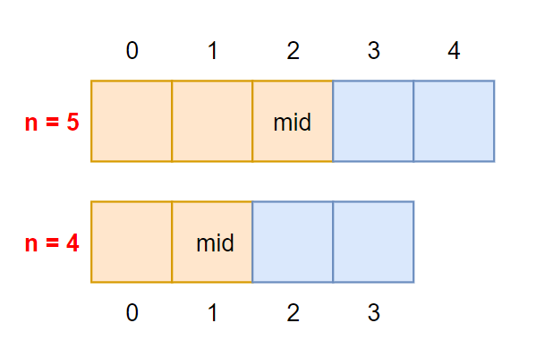

# sort

排序最好的教学一定是 算法4 里讲的，分析了每一种算法的优劣，以及什么时候选用哪一种，而且以清晰的图示和举例以及最后的用例测试分析来说明每一个算法。

对于排序的感受是两个操作 compare 和 swap。按照算法四里的方法来说，其实核心就是 less 函数和 exch 函数。此处只针对数组，所以这两函数一般有三个入参 (arr, i, j)。如下

```java
private boolean less(int[] arr, int i, int j) {
    return a < b;
}
// 有一些更简洁有效的方式如异或 ^,但是对于 0 或负数有一些影响，不推崇
private void exch(int[] arr, int i, int j) {
    int aux = arr[i];
    arr[i] = arr[j];
    arr[j] = aux;
}
```

以下排序我们都建立在使乱序数组变为升序的前提下。

## 冒泡排序

冒泡即每次都要冒出一个最大的泡泡到数组末尾，那么长度为 n 的数组，我们冒 n-1 次即可。我们有两个问题，第一个问题是我们需要总的冒 n-1 次泡泡才能处理完整个数组，第二个问题是每一次冒一个最大的泡泡到末尾需要比较除最后一个元素外的其它所有元素，如何控制本次处理中的所有元素是除了最后已有序之外的元素呢？通过用 n 减去操作次数即可得。所以需要两层循环，如下：

```java
private void sort(int[] arr) {
    int n = arr.length;
    for (int i = 0; i < n - 1; i++) {
        for (int j = 1; j < n - i; j++) {
            if (less(arr, j, j - 1)) exch(arr, j, j - 1);
        }
    }
}
```

## 选择排序

选择排序即每次我们需要选出一个第一大、第二大、第三大...的数的下标，然后和对应它的位置进行交换。由于数组一般都是从前往后遍历，我们也可以去选择第一小、第二小、第三小...然后去进行交换，交换 n-1 次即可得到答案。

```java
private void sort(int[] arr) {
    int n = arr.length;
    for (int i = 0; i < n - 1; i++) {
        int min = i;
        for (int j = i + 1; j < n; j++) {
            if (less(arr, j, min)) min = j;
        }
        exch(arr, i, min);
    }
}
```

## 插入排序

插入排序是模拟一种插入扑克牌的思想，你拿到一张牌，你要先放在边上，然后依次比较最后插入到最合适的位置，插入具体的一个位置，伴随着该扑克牌插入前位置的所有元素的位置需要交换一下。但是如果牌堆本来有序，那么你就不需要去处理交换，可以快速处理下一个元素，在数据量不大，或者几乎有序的时候，插入排序效率很高。

```java
private void sort(int[] arr) {
    int n = arr.length;
    for (int i = 1; i < n; i++) {
        for (int j = i; j > 0 && less(arr, j, j - 1); j--) exch(arr, j, j - 1);
    }
}
```

## 归并排序

归并排序的思想就用到递归了，它的思想是先分后合，先划分到每一个都是有序的子数组，然后在一一合并两个有序的子数组为原数组。思想是这样，具体的实现，一定要注意合并这个过程，因为划分我们是没有什么操作的，只是简单的递归。但是合并一般最好是在原数组合并，所以有一些细节：

1. 首先是递归一定要有一个返回条件，什么时候返回呢？我们处理的是 [lo, hi] 区间内的数组的归并，当发现划分到 hi < lo 了，必然说明该返回了。
2. 对于奇偶数长度的数组 arr，我们的划分是咋样的？一般划分会是左区间长度大于右区间。
   可以举例如果 n 为 5，则 mid 第一次为 2，n 为 4，mid 为 1。
3. 如果子数组就是元素本身，需要提前返回吗？对于归并来说，只有一个元素，肯定直接返回，因为已经有序。所以返回的判断条件为  `hi <= lo` 什么时候回 hi < lo 呢？参数传递错误！！！服了，就是错误的调用才会发生这个情况，为了程序的健壮性才这么写，但因为我们的 sort(arr, lo, hi) 是被 sort(arr) 里唯一调用的，所以直接写 `if (lo == hi) return ;` 也没有一点问题。



```java
private void sort(int[] arr) {
    int n = arr.length; // sort 函数按照上述排序来写
    sort(arr, 0, n - 1); // 我们处理闭区间
}
private void sort(int[] arr, int lo, int hi) {
    if (hi == lo) return;
    int mid = lo + (hi - lo) / 2;
    sort(arr, lo, mid);
    sort(arr, mid + 1, hi);
    merge(arr, lo, mid, hi);
}
```

那么如何合并呢，如何在原数组里进行处理呢：

- arr[lo...mid] 是一个有序区间，arr[mid + 1, hi] 是一个有序区间
- 让 i 和 j 两个指针分别指向两个子数组的开始，逐个比较遍历两个子数组即可。
- 因为我们的更改最终要回归于原数组，所以我们需要做一个原数组的副本，在副本上进行遍历，然后回写原数组。
- 如果 i 和 j 指向的是同一个元素，那么可以额外处理防止两次，也可以当一次处理代码更简单，即当 i 指向的元素小于或者等于 j 所指向元素我们都先让 i 指针的元素进结果数组，算是一个约定。

```java
int[] aux = new int[n]; // 辅助数组
private void merge(int[] arr, int lo, int mid, int hi) {
    // 归并 lo->hi 所以只需要拷贝这一部分就行
    System.arraycopy(arr, lo, aux, lo, hi - lo + 1);
    int i = lo, j = mid + 1, k = lo;
    while (i <= mid || j <= hi) {
        if (i > mid) arr[k++] = aux[j++];
        else if (j > hi) arr[k++] = aux[i++];
        else if (aux[i] <= aux[j]) arr[k++] = aux[i++];
        else arr[k++] = arr[j++];
    }
}
```

## 快速排序

快速排序是使用最多的排序算法，它的核心思想是什么呢？每次找出一个值最终的位置，然后在最终位置划分后的区间分别去找另一个随机元素的最终的位置，它的每一次保证了大于该随机元素的值都出现在右边，小于随机元素的值都出现在左边，所以如果每次都能划分到中间，那么就几乎和二分一样了，选择排序是每次从剩余的所有元素选一个最小的交换，而快速排序是选一个之后，默认整体就更加有序了，选定的元素左边都比它小，右边都比它大，如果每次都能找到折中的那个元素，那我们只需要找 logn 次就划分完了所有区间。

对于如何找这个随机值，其实有不同的策略，最简单的策略是每次拿子数组最左边的那个元素作为基准值，然后将它归位到它最后的合适的位置。所以我们的算法大逻辑就是每次去找到一个数组中的一个下标，该下标左边的值全小于该下标指向的值，右边的值都大于该下标指向的值，然后在剩余的两个子区间再进行这样的划分逻辑。

注意查找的过程：如果我们设定 [lo, hi] 区间为待排序数组，设 pivot 元素为 arr[lo]，用 i 和 j 两个指针分别去从数组两端双指针遍历，那么先考虑边界情况，

- 如果 lo 右边的所有元素都小于 arr[pivot]，则 i 会到达 hi 的位置
- 如果 lo 右边的所有元素都大于 arr[pivot]，则 j 会到达 i 的位置

问题的重点在于，我们让 i 和 j 最终停留在哪个位置？我们怎么交换 pivot 处的元素？

我们肯定的一点是因为 j 是往左走，所以它最远到达 pivot 的位置，但是 i 可以到达数组越界的位置 。

- 如果 j 到达 pivot 的位置，就不需要再做交换，下一次 sort(arr, pivot, pivot - 1) 发生 hi < lo 的情况
- 如果 i 到达了 hi 的位置，i == j，说明 pivot 的值需要和 hi 位置进行交换。


```java
public void sort(int[] arr) {
    int n = arr.length;
    sort(arr, 0, n - 1);
}

private void sort(int[] arr, int lo, int hi) {
    if (hi <= lo) return; // 快排需要处理 hi<lo 的情况
    int pivot = partition(arr, lo, hi);
    sort(arr, lo, pivot - 1);
    sort(arr, pivot + 1, hi);
}
```

```java
private int partition(int[] arr, int lo, int hi) {
    int pivot = lo, v = arr[lo];
    int i = lo + 1, j = hi;
    while (true) {
        while (i < hi && v <= arr[i]) i++; // 相同元素？定义为找第一个比 pivot 大的元素位置
        while (j > lo && v > arr[j]) j--;
        if (j <= i) break;
        exch(arr, i, j);
    }
    exch(arr, pivot, j);
    return j;
}
```

至此，基本排序算法，处理结束！！！